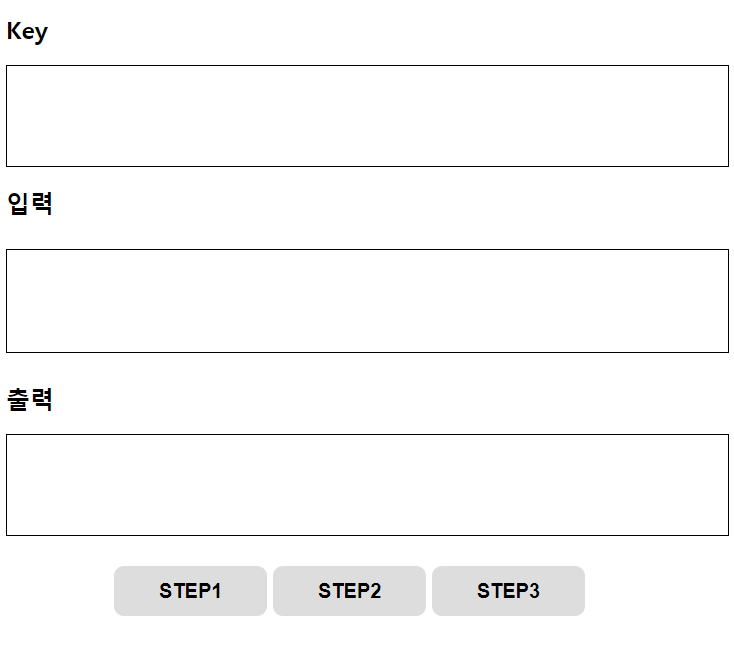

# CHER-16

입력값을 대칭키로 암호화하고 다시 복호화하는 간단한 프로젝트.
**목표 : LocalStorage, IndexedDB, Webcrypto 기술 익히기**

----------

### Encryption

> **STEP1 Click:**
> IndexedDB 에서 대칭키 가져오기 → (없다면 키 생성해서 저장)
→ 가져온 대칭키로 "입력"값 암호화 → 키값과 암호문을 LocalStorage에 저장
***localStorage.setItem(key, encrypted)***

### Decryption

> **STEP2 Click:**
> LocalStorage에서 키에 매칭되는 암호문 가져오기
***localStorage.getItem(key)***
→ IndexedDB에서 대칭키 가져오기 → 가져온 대칭키로 암호문을 복호화
→ "출력"에 복호화된 결과 출력

### Delete

> **STEP3 Click:**
> IndexedDB를 제외한 모든 데이터 삭제

----------

> **Note:**

> - 대칭키는 최초 한번만 생성
> - Key 생성 및 암복호화 시 WebCrypto 사용
